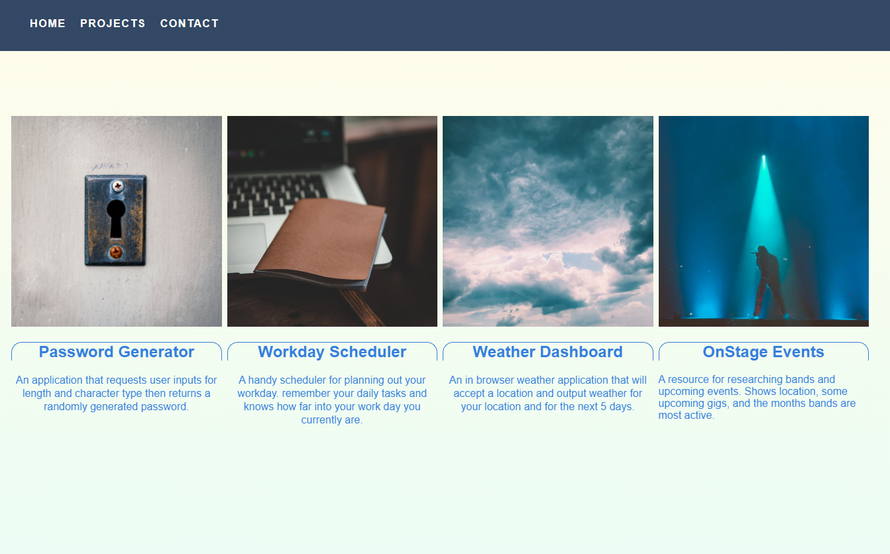

# Portfolio

## Table of Contents
The following readme contains these sections:

* [Screenshot](#Screenshot)
* [Usage](#Usage)
* [Live-Link](#Live-Link)
* [License](#License)

## Screenshot

## Usage

[This Developer Portfolio](https://joey-sisk.github.io/Portfolio/#header) Was designed as an update to my previous portfolio. I wanted to use a framework that I was unfamiliar with that would also allow me to really customize my design and not box me in. I decided to use the [Tachyons Framework](http://tachyons.io/) and for animations I used [Animate On Scroll.](https://michalsnik.github.io/aos/) I feel like this portfolio came to together much more smoothly and looks more professional now that I have learned much more about front end design. There are things I think I will still go back and improve, but I feel like this represents my development and is a good foundation for a long term portfolio design.

This would not have been possible without the help of my tutor Kumar Ramanathan, my instructor Calvin Carter, all of the class TA's, and many of my fellow UT Bootcamp students.

## Live-Link

[You can find a link to the live site here.](https://joey-sisk.github.io/Portfolio/)

## License

There is not currently a license for this service as it is only a homework assignment for the UT Coding Bootcamp Class 2020-2021
